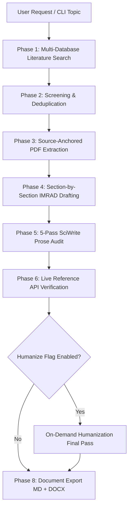
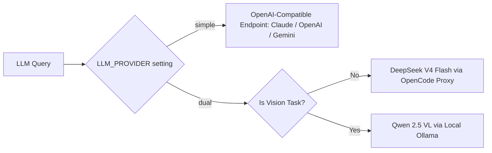

# MedDraft_AI — Architecture Specification

## System Overview

MedDraft_AI is structured as a 13-stage pipeline orchestrated by `main.py`:

## Provider Routing Architecture

MedDraft_AI supports two execution pathways for language models:

## Module Structure

- `meddraft_ai.core`: Configuration management, LLM interface, provider routing.
- `meddraft_ai.search`: Multi-database APIs and Playwright stealth browser engine for Google Scholar.
- `meddraft_ai.extraction`: Docling-based text/table extraction, PDF reading, page-level citation anchoring.
- `meddraft_ai.screening`: PICO abstract/fulltext screening, RIS/CSV parsing, PRISMA flow diagrams.
- `meddraft_ai.agents`: CoreWriter, Humanizer, VerifierAndStats, ProofReader, MedicalWriterAgent.
- `meddraft_ai.validation`: Live CrossRef and PubMed reference verification.
- `meddraft_ai.export`: Python-docx and Pandoc Markdown-to-DOCX conversion with publisher styles.
