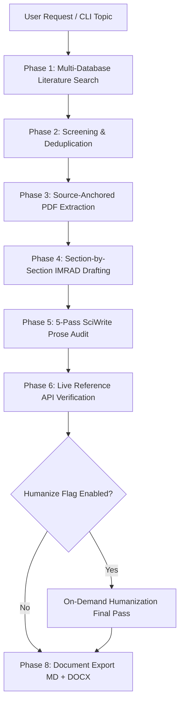
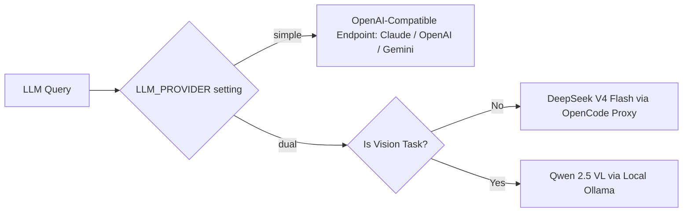

# MedDraft_AI — Architecture Specification

## System Overview

MedDraft_AI is structured as a multi-phase pipeline orchestrated by `main.py`:

```mermaid
graph TD
    A[User Request / CLI Topic] --> B[Phase 1: Multi-Database Literature Search]
    B --> C[Phase 2: Screening & Deduplication]
    C --> D[Phase 3: Source-Anchored PDF Extraction]
    D --> E[Phase 4: Section-by-Section IMRAD Drafting]
    E --> F[Phase 5: 5-Pass SciWrite Prose Audit]
    F --> G[Phase 6: Live Reference API Verification]
    G --> H{Humanize Flag Enabled?}
    H -- Yes --> I[On-Demand Humanization Final Pass]
    H -- No --> J[Phase 8: Document Export MD + DOCX]
    I --> J
```

## Provider Routing Architecture

MedDraft_AI supports two execution pathways for language models:

```mermaid
graph LR
    A[LLM Query] --> B{LLM_PROVIDER setting}
    B -- simple --> C[OpenAI-Compatible Endpoint: Claude / OpenAI / Gemini]
    B -- dual --> D{Is Vision Task?}
    D -- No --> E[DeepSeek V4 Flash via OpenCode Proxy]
    D -- Yes --> F[Qwen 2.5 VL via Local Ollama]
```

## Module Structure

- `meddraft_ai.core`: Configuration management, LLM interface, provider routing, and the `SkillRegistry` that indexes prompt packs.
- `meddraft_ai.search`: Multi-database APIs and Playwright stealth browser engine for Google Scholar.
- `meddraft_ai.extraction`: Docling-based text/table extraction, PDF reading, page-level citation anchoring.
- `meddraft_ai.screening`: PICO abstract/fulltext screening, RIS/CSV parsing, PRISMA flow diagrams.
- `meddraft_ai.agents`: CoreWriter, Humanizer, VerifierAndStats, ProofReader, MedicalWriterAgent.
- `meddraft_ai.validation`: Live CrossRef and PubMed reference verification.
- `meddraft_ai.export`: Python-docx and Pandoc Markdown-to-DOCX conversion with publisher styles.

## Skill & Prompt Registry

Two skill layers feed the system:

- **Pipeline prompt packs** live in `meddraft_ai/prompts/`. The `SkillRegistry` (`meddraft_ai/core/skill_registry.py`) indexes every `.md`/`.txt` file at runtime; a new pack only needs its folder name added to `REGISTERED_PROMPT_SUBDIRS` in that module.
- **Agent skills** live in `.agents/skills/` (guard skills for code/test/docs review plus the `thesis-master-guide` compliance skill). They are pinned in `skills-lock.json` (`npx skills` lockfile format); `tests/test_skills_lock.py` enforces that every installed skill directory has a lock entry.
