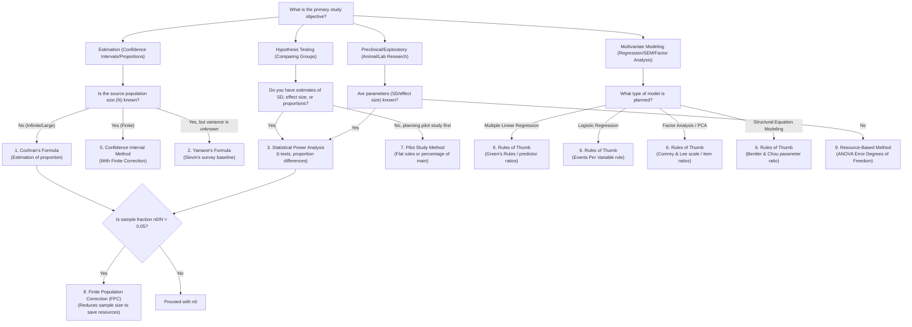

# Advanced Sample Size Calculator Skill Guide

This skill guide outlines the theoretical concepts, selection rules, mathematical definitions, and reporting templates for the **9 primary methods of sample size calculation** in medical and clinical research.

---

## 1. When to Use & Method Selection Flowchart

Use this skill when designing a study protocol, writing the methods section of a thesis or manuscript, or validating the feasibility of a clinical trial.

To select the correct sample size calculation method, follow this clinical decision workflow:



---

## 2. Summary of the 9 Methodologies

### 1. Cochran's Formula
- **Objective**: Estimating a population proportion in a large/infinite population.
- **Formula**: $n_0 = \frac{Z^2 \cdot p(1-p)}{e^2}$
- **Default**: $p=0.50$ (maximum variance/most conservative), $Z=1.96$ (95% confidence).

### 2. Yamane’s Formula (or Slovin’s Formula)
- **Objective**: Simplified sample size calculation for a finite population when no prior parameter estimates or variance are available.
- **Formula**: $n = \frac{N}{1 + N \cdot e^2}$
- **Usage**: Typically used in descriptive surveys.

### 3. Statistical Power Analysis
- **Objective**: Determining sample size for hypothesis testing to control both false positives ($\alpha$) and false negatives ($\beta$).
- **Common tests**:
  - Two-arm independent t-test: $n_{\text{group}} = \frac{2 \cdot (Z_{\alpha/2} + Z_{\beta})^2}{d^2}$ (where $d$ is Cohen's $d$).
  - Two-arm comparison of proportions: $n_{\text{group}} = \frac{(Z_{\alpha/2} + Z_{\beta})^2 \cdot (p_1(1-p_1) + p_2(1-p_2))}{(p_1 - p_2)^2}$.

### 4. Krejcie–Morgan Table / Formula
- **Objective**: Determining sample size for a finite population based on chi-square distribution of proportions.
- **Formula**: $n = \frac{\chi^2 \cdot N \cdot P(1-P)}{e^2(N-1) + \chi^2 \cdot P(1-P)}$
- **Parameters**: $\chi^2 = 3.841$ for 95% confidence level.

### 5. Confidence Interval Method (Precision-Based)
- **Objective**: Estimating population means or proportions with a specified precision (margin of error).
- **Mean estimation formula**: $n = \left(\frac{Z \cdot \sigma}{E}\right)^2$

### 6. Rules of Thumb
- **Objective**: Sizing sample for complex multivariable statistical modeling:
  - **Multiple Linear Regression**: Green's rule ($N \ge 50 + 8k$ for overall fit, $N \ge 104 + k$ for individual predictors) or 15 subjects per predictor.
  - **Logistic Regression**: Events Per Variable rule ($N = \frac{\text{EPV} \cdot k}{\text{prevalence}}$, typically $\text{EPV}=10$ or $15$).
  - **Factor Analysis**: Comrey & Lee scale ($100 = \text{poor}$, $300 = \text{good}$, $500 = \text{very good}$) or subject-to-variable ratios.
  - **SEM**: Bentler & Chou ratio (5:1 to 10:1 per parameter, $N \ge 200$ minimum).

### 7. Pilot Study Method
- **Objective**: Preliminary feasibility assessment.
- **Rules**: Julious flat rule ($n=12$ per group), Lancaster flat rule ($N=30$ total), or $10-20\%$ of the calculated main study sample size.

### 8. Finite Population Correction (FPC)
- **Objective**: Correcting an initial sample size $n_0$ (derived for infinite population) when sampling from a relatively small finite population $N$.
- **Formula**: $n = \frac{n_0}{1 + \frac{n_0 - 1}{N}}$ (typically applied if $n_0/N > 0.05$).

### 9. Resource-Based (Resource Equation) Method
- **Objective**: Sizing exploratory laboratory or animal studies when power parameters are completely unavailable.
- **Formula**: $E = N - B - T$ (where $E$ is error degrees of freedom, targeting $10 \le E \le 20$).

---

## 3. Python Integration & CLI Invocation

To avoid calculation errors and floating-point hallucinations, the system uses a **deterministic Python calculator**. Call it from the shell or via python script execution:

```bash
# General Syntax
python mega_agent/main.py sample-size --method <method_name> [options]

# Examples:
# 1. Cochran's Formula
python mega_agent/main.py sample-size --method cochran --p 0.5 --e 0.05 --confidence 0.95

# 2. Statistical Power Analysis (Two-sample continuous outcome)
python mega_agent/main.py sample-size --method power --test-type two_sample_t_test --cohens-d 0.5 --alpha 0.05 --power 0.80

# 3. Rules of Thumb (Logistic Regression)
python mega_agent/main.py sample-size --method rules --analysis-type logistic_regression --num-predictors 5 --prevalence 0.15 --epv 15
```

---

## 4. Reporting Templates for Medical Manuscripts

### Template A: Statistical Power Analysis (RCT / Comparative Study)
> "A formal sample size calculation was performed to determine the study cohort size required to detect a clinically significant difference in [outcome variable] between the treatment and control groups. Based on prior literature, the expected pooled standard deviation was assumed to be [SD], and the minimum clinically important difference was set to [Difference], representing an effect size of Cohen’s $d = [d]$. Assuming a two-sided significance level ($\alpha$) of 5% and a statistical power of 80% ($Z_{\beta} = 0.84$), a sample size of [N_per_group] participants per group was calculated. Adjusting for an anticipated attrition/dropout rate of [Dropout]%, we planned to recruit a total of [N_total] participants ([N_adjusted] per arm)."

### Template B: Cochran's / Precision Proportion (Epidemiological Survey)
> "To estimate the prevalence of [disease/attribute] with appropriate precision in the target population, we determined the sample size using Cochran’s formula: $n_0 = (Z^2 \cdot p \cdot (1-p)) / e^2$. Assuming an expected proportion ($p$) of [Prevalence]% (representing maximum variance of 0.50), a confidence level of 95% ($Z = 1.96$), and a margin of error ($e$) of [Error]%, the minimum required sample size was calculated as [n0] participants. [If FPC applied]: Given the finite population of [N] registry patients, the finite population correction (FPC) was applied, reducing the minimum sample size to [n_final] participants."

### Template C: Resource Equation Method (Preclinical / Animal Trial)
> "As prior standard deviations and effect sizes for [experimental outcome] were not available in the literature, a resource equation method was employed to determine the cohort size. Based on a design containing [Groups] treatment groups ($T = [groups - 1]$ degrees of freedom) and a randomized block design ($B = [blocks - 1]$ degrees of freedom), we targeted an error degrees of freedom ($E$) of 10 to 20 to ensure statistical validity while minimizing animal use. A group size of [n] animals per arm (Total $N = [N]$) was selected, yielding a realized error degrees of freedom of $E = [E]$, which complies with Institutional Animal Care and Use Committee (IACUC) guidelines."
